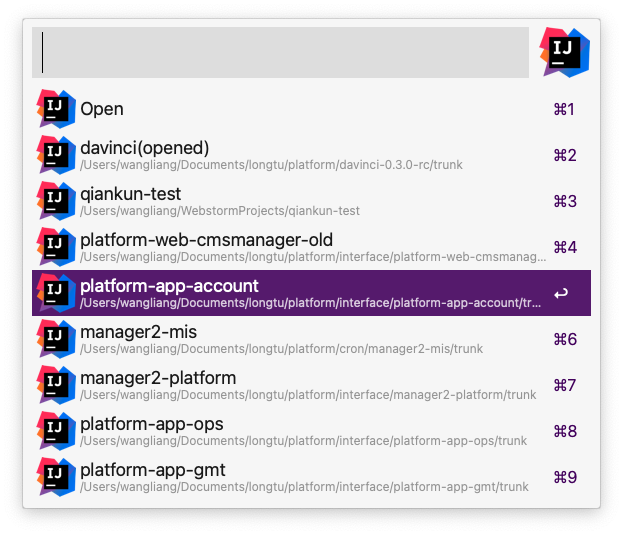

## @liangshen/alfred-intellij-idea

*Alfred工作流，快速启动IntelliJIDEA软件中打开过的项目*
*Alfred workflow for IntelliJ IDEA*

### 运行环境

* MacOS
* Nodejs 14.x.x
* Alfred Powerpack
* IntelliJ IDEA

### 安装

```
npm i -g @liangshen/alfred-intellij-idea
```

### 使用方法

可使用 option + I 快捷键调出Idea工作流搜索框(或者调出alfred搜索框输入关键字 idea)

回车可使用IntelliJ IDEA打开项目, 按住Command键回车可在Finder中打开项目




